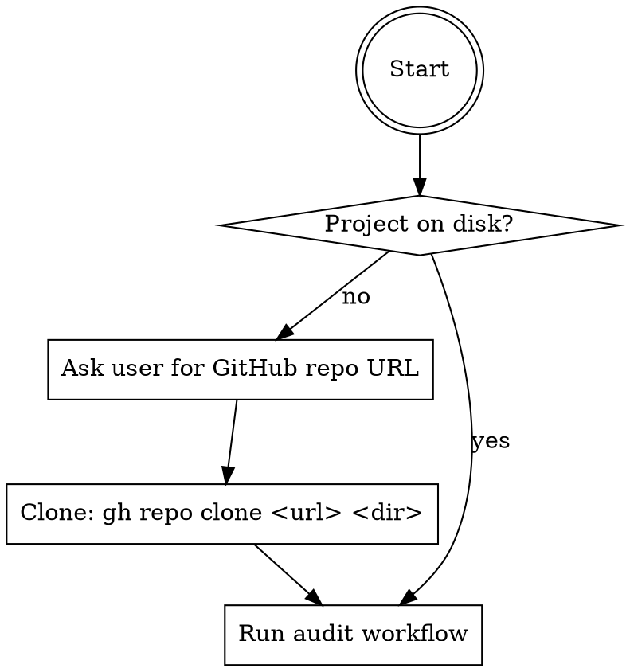

# Security Audit (OWASP Top 10:2025)

## Overview

Perform a systematic security audit of an application using the OWASP Top 10:2025 as the checklist. Produces a structured report with findings, severity ratings, and suggested fixes stored under `audit/<YYYY-MM-DD>/`.

## Entry Path

**Determining if a project exists:** check whether the current working directory contains source files (pom.xml, package.json, build.gradle, src/, etc.). If not, ask the user for a GitHub URL before proceeding.

## Audit Workflow

For each OWASP category (A01–A10):

1. Read the matching reference doc from `references/` in this skill directory
2. Search the codebase for the patterns listed in that doc's audit checklist
3. Record every finding with: severity, file path + line, description, risk, and suggested fix
4. If no issues found for a category, note it explicitly as "No findings"

Cover ALL modules in the project — for Maven multi-module projects scan every submodule, not just root.

### Severity Scale

| Level | Meaning |
|-------|---------|
| Critical | Direct exploit path, data breach, RCE possible |
| High | Significant risk, exploitable with moderate effort |
| Medium | Exploitable under specific conditions |
| Low | Defense-in-depth gap, low direct impact |
| Informational | Best practice deviation, no direct exploit |

### OWASP Top 10:2025 Checklist

| Code | Category | Reference Doc |
|------|----------|---------------|
| A01 | Broken Access Control | references/A01-broken-access-control.md |
| A02 | Security Misconfiguration | references/A02-security-misconfiguration.md |
| A03 | Software Supply Chain Failures | references/A03-software-supply-chain.md |
| A04 | Cryptographic Failures | references/A04-cryptographic-failures.md |
| A05 | Injection | references/A05-injection.md |
| A06 | Insecure Design | references/A06-insecure-design.md |
| A07 | Authentication Failures | references/A07-authentication-failures.md |
| A08 | Software or Data Integrity Failures | references/A08-software-data-integrity.md |
| A09 | Security Logging and Alerting Failures | references/A09-security-logging.md |
| A10 | Mishandling of Exceptional Conditions | references/A10-exceptional-conditions.md |

## Output

**Report location:** `<project-root>/audit/<YYYY-MM-DD>/security-report.md`

Use today's date. If a report for that date already exists, suffix with `-2`, `-3`, etc.

Use the template at `references/report-template.md` for the report structure.

## Common Mistakes

- Auditing only the root module — scan every submodule
- Skipping categories with no obvious findings — always note "No findings" explicitly
- Generic fix suggestions — provide concrete code examples matching the project's language/framework
- Storing the report outside the project root — always place it inside the project being audited
